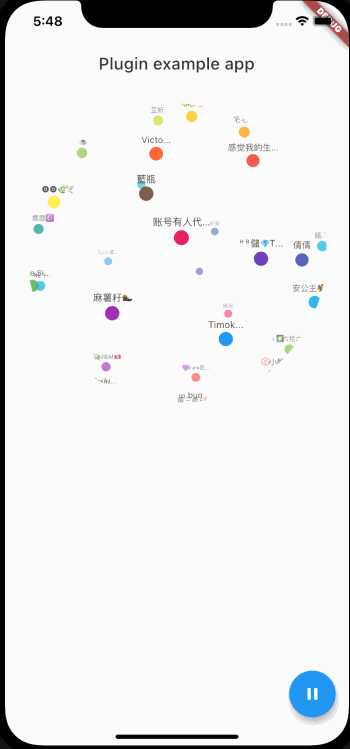

# flutter\_3d_ball

一个自动旋转的仿3D球体



## 特性
+ 支持手动/自动转动
+ 支持暂停/继续转动控制
+ 支持高亮处理部分标签

## Getting Started

```
RBallView(
  isAnimate: provider.curIndex == 0,
  isShowDecoration: false,
  mediaQueryData: MediaQuery.of(context),
  keywords: snapshot.data,
  highlight: [snapshot.data[0]],
  onTapRBallTagCallback: (RBallTagData data) {
    print('点击回调：${data.tag}');
  },
),
```
